<h3><code>manish@github ~ $ ./contributions.sh</code></h3>

  

<h3><code>manish@github ~ $ whoami</code></h3>

<table>
<tr>
<td valign="top"></td>
<td valign="top"></td>
</tr>
</table>

 

<code>manish@github ~ $ links --list</code>

[Portfolio](https://manishchoudharyportfolio.vercel.app/) · [LinkedIn](https://www.linkedin.com/in/manish-choudhary110904) · [manish.athith@gmail.com](mailto:manish.athith@gmail.com)

